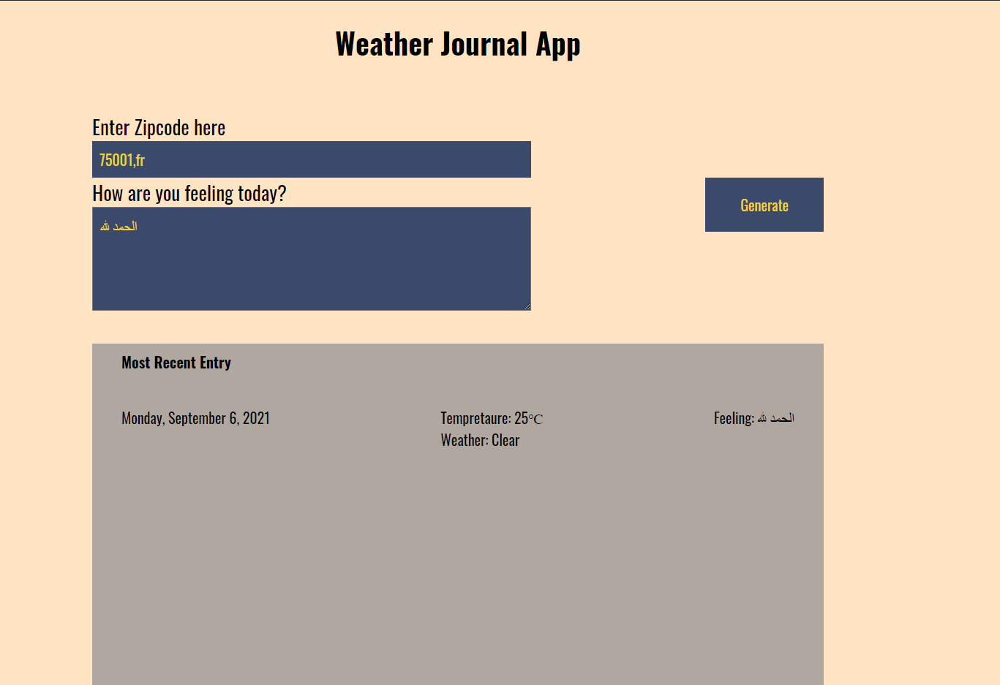

# Weather-Journal App Project

This simple dynamic project get the user weather data for a certain Zip code & country code, ask him about his current feeling and show them in a layout (Most Recent entry).

It uses Open weather Weather API 
to get data and save them to a local server and then get them again to be laid out. 

## Table of Contents
Form with two inputs to enter zip & feeling
and a button to Generate

## Project Preview

## Dependencies

Node.js Enviroment  v14.17.5

    1- Express 
    2- Body Parser 
    3- CORS